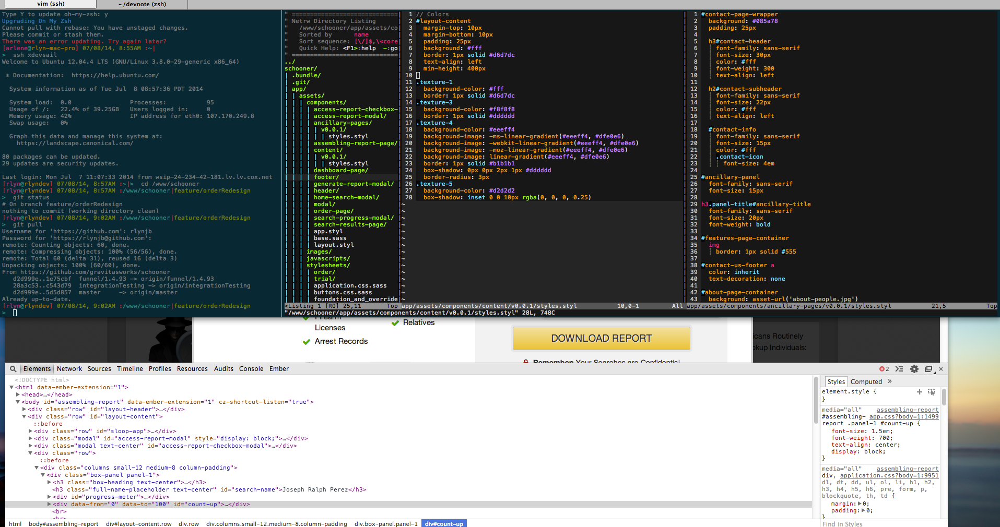

dotfiles
=======================

This repo contains learnings and tools I've gathered from becoming a full fledged Front-End Developer

### Settings up my development environment
1. Install HomeBrew first
2. Install Google Chrome and iTerm2
3. Use Terminal to configure iTerm2 to my preferred settings

```
killall cfprefsd     # This will get rid of cached settings
rm  ~/Library/Preferences/com.googlecode.iterm2.plist
ln -s ~/dotfiles/com.googlecode.iterm2.plist ~/Library/Preferences/com.googlecode.iterm2.plist
```

4. Now, Install oh-my-zsh https://gist.github.com/tsabat/1498393
5. Remove pygmalion theme
6. Copy and paste my pygmalion theme 
7. vim up .zshrc file and change zsh theme = russell to pygmalion

### Setting up my VIM theme and configs
1. Copy ```.vim``` and ```.vim-rc``` unto root directory
```
cd ~/dotfiles/
cp -R .vim .vim-rc ~/
```
2. Now, type ```vim ``` on iTerm
3. and type ```:E``` for Tree listing of files


#### Keyboard Keys + Shortcuts
Tasks | Vim | Tmux | iTerm | Chrome
--- | --- | --- | --- | ---
Key-Bind | Ctrl | Alt/Option + A | Cmd | Cmd
Open new pane | v | d | d | -
Split Pane vertically | - | Shift + " | - | -
Open new window | - | t | t | t
Navigate through panes | h,j,k,l | Left, Right | [, ] | -
Navigate through windows | - | [, ] | Left, Right | Shift + Cmd + [,]
Scoll in pane | Shift + [, ] | Page Up, Page Down for quick nav. For per line is arrows Up, Down | Shift + Page Up, Page Down | Key Arrows
Exit of of Scroll pane mode | - | press Enter | - | -
Close a pane | :q | e | w | -
Close a window | - | w | w | w
Resize pane | Shft + hjkl | h, l | -
Open Dev Tool | - | - | - | Opt + Cmd + i


##### Commandline 
```
// to search through files like Sublime-ish style
grep -rnC2 "text here" directory_here/

// search and replace
grep -rl matchstring somedir/ | xargs sed -i 's/string1/string2/g'
// sample
grep -rl 'windows' ./ | xargs sed -i 's/windows/linux/g'
```
##### Git Tig
```
tig // to open git tig
press Shft + s // to view un/staged files
press u // to toggle files to be staged or unstaged
press q // to quit view
press Shft + c // to commit and write commit msg
```
